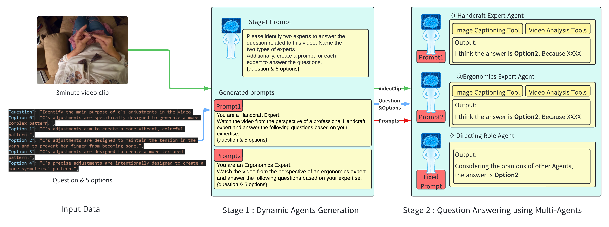

# VDMA : Video Question Answering with Dynamically Generated Multi-Agents


This is official implementation for paper: VDMA: Video Question Answering with Dynamically Generated Multi-Agents


## 🚩 Preparation

### 1.0 Download the EgoSchemaVQA dataset
Please refer to the following official repository to download the dataset.<br>
https://github.com/egoschema/EgoSchema

You can download the Question file of EgoSchemaVQA dataset from the following link:<br>
This link is from LLoVi's github.<br>
 https://drive.google.com/file/d/13M10CB5ePPVlycn754_ff3CwnpPtDfJA/view?usp=drive_link


### 1.1 GPT4o Model

To use GPT-4o, you need to create a list of images generated from the EgoSchemaVQA dataset. You can use the following command to generate the list of images:

```bash
python3 convert_videos_to_images.py
```

### 1.2 Azure GPT4 Vision Model

To use the Azure GPT-4 Vision Model, you need to create the video index file.<br>
※If you are not using Azure GPT-4 Vision, please comment out the relevant code.

For detailed information about the Azure GPT-4 Vision Model, please refer to the following link:<br>
https://learn.microsoft.com/en-us/azure/ai-services/openai/how-to/gpt-with-vision?tabs=rest%2Csystem-assigned%2Cresource#use-vision-enhancement-with-video


```bash
python3 create_video_index.py
```

### 1.3 LLoVi Caption Data

Our model uses the LLoVi caption data. You can download the LLoVi caption data from the following link.<br>
https://github.com/CeeZh/LLoVi

Then you need to set the collect path of the LLoVi caption data in the following file.<br>
retrieve_video_clip_captions function is regarding the LLoVi caption data.

```bash
retrieve_video_clip_captions.py
```

### 1.4 Set the environment variables

You need to set the environment variables in the following file.

```bash
docker/.env
```

Our model uses the Azure OpenAI, Azure Blob Storage, Azure Computer Vision, OpenAI. So, Please set the access infomation into the environment variables.


## 🚀 Run

Build the docker image and run the container.

```bash
cd VDMA/docker
docker compose build
docker compose up -d
```

Enter the container and run the following command.
```bash
python3 main.py
```

## 📄 Citation

If you find this code useful, please consider citing our paper.

```bibtex
@article{VDMA,
  title={VDMA: Video Question Answering with Dynamically Generated Multi-Agents},
  author={Noriyuki Kugo and Tatsuya Ishibashi and Kosuke Ono and Yuji Sato},
  journal={ArXiv},
  year={2024},
  volume={abs/TBA},
  url={https://github.com/PanasonicConnect/VDMA}
}
```